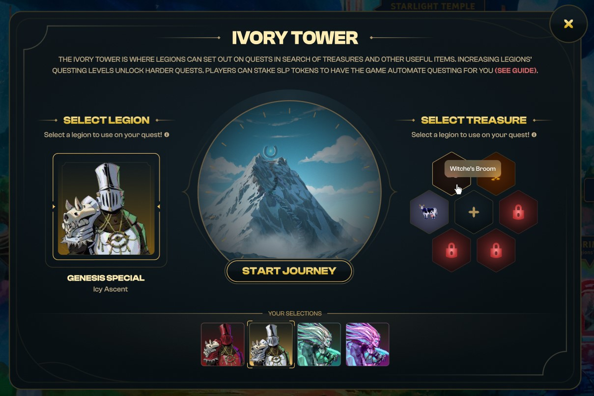

# Ivory Tower

The Ivory Tower is where Legions can set out on quests in search of Treasures and other items, growing more experienced as they continue to explore Bridgeworld’s frontiers. Questing points are awarded per completed quests, and these are used to automatically gain questing levels.

 (1) (1).png>)

## **TLDR:**

* Quest duration are 7.5 hours / stage
* Players can select multiple questing “zones”, each dropping different loot
  * Corruption Canyons ⇒ Alchemy and Arcana fragments
  * Icy Ascent ⇒ Enchanting and Brewing fragments
  * Desert Ruins ⇒ Smithing and Leatherworking fragments
* Constellations protect legions from stasis (temporary freeze) and enable them to equip more treasures, to be used in the “Treasure Triad” card game at the end. Each constellation level, up to 7, allows one Treasure to be equipped.
* Genesis Legions are (1) immune to stasis, (2) have better fragment drop rates and (3) have a low chance to loot full Treasures
* Quests drop [soulbound ](https://vitalik.eth.limo/general/2022/01/26/soulbound.html)fragments, can be combined via mini-crafts to full&#x20;

## Embarking on Quests 

In order to progress further into a journey, legions must satisfy questing level requirements:

* Section 1: requires questing level 1
* Section 2: requires questing level 2
* Section 3: requires questing level 3

#### **An illustration of the questing progress is shown below:**

Continuing a journey for rarer treasures comes with risk. Users forfeit whatever loot they earned in the previous sections **(see Rewards Section)**, and run the risk of falling into “stasis”, which will temporarily immobilize the legion (4 hrs at the time of writing).&#x20;

Each level of constellation reduces stasis risk from the default 30% chance:

**Note that each questing “zone” is affiliated with two elemental constellations.** In order for constellations to have any effect for a particular zone, legions must upgrade one of the two correct constellations for the right zone. The “zone elemental affinities” are as follows:

* Corruption Canyons: Fire, Earth
* Desert Ruins: Wind, Water
* Icy Ascent: Light, Dark

## **Ending Journeys with Treasure Triad**

In the third and final section of a journey, legions will play the Treasure Triad game using Treasures they equipped at the beginning. The goal is to flip as many cards to your control which boosts the loot drop rate. The game works as follows:

1. Cards have 4 stats for the “north”, “east”, “south”, and “west” sides of the card.&#x20;

1. When a card is placed next to another card, if the stats on your card is higher on the touching sides, you flip the adjacent card to your color!
2. Players can place up to 3 cards on the grid by dragging and dropping a Treasure in their deck to an unflipped grid location of their choice.&#x20;
   * Simply click on a card to unplay it and move it back to your deck.&#x20;
3. Grid cells with a purple color have a status effect of “corruption”. If you do not play a card on a corrupted grid cell, your legion will be put in stasis (frozen for X hours).&#x20;
   * Game generates at most 2 corrupted cells.
   * 1 unflipped “corruption” grid cell ⇒ 12 hrs stasis
   * 2 unflipped “corruption” grid cells ⇒ 24 hrs stasis
   * Note - genesis legions cannot be put in stasis.
4. Once you play 3 cards, click “Finish Games” to submit a metamask transaction to complete the quest. Note that you do not have to place all 3 cards to finish the game.&#x20;
5. The more cards flipped into your control, the higher the drop rate!
   * 1 card ⇒ +3%
   * 2 cards ⇒ +6%
   * 3 cards ⇒ +9%
   * Fragment standard drop rate is 60% so 3 cards flipped = 60 + 9 = 69%

.png>)

### Additional Game Mechanics

Two grid cells in the game are randomly selected to have “affinities” (alchemy, arcana, etc).&#x20;

* Treasures are grouped into “affinities”
  * Alchemy, arcana, brewing, leatherworking, smithing, etc
* If a treasure of the same affinity as the cell is placed, the card enjoys a +1 stat boost
  * e.g. Donkey is a “leather working” affinity treasure. When placed on a cell with a “leather working” affinity, will enjoy a +1 boost to stats.
  * Each legion class has “affinities”, when they place a card on the gridCell with the same affinity, they get a +1 boost to the stats
  * \+2 stat point boosts at most.

.png>)

## Quest Rewards

.png>)

Drop rates for Treasure fragments ([**soulbound** ](https://vitalik.eth.limo/general/2022/01/26/soulbound.html)**and non-transferable**) are set to 60%, and each zone drops a category of treasure fragments as follows:

* Corruption Canyons ⇒ Alchemy/Arcana fragments
* Icy Ascent ⇒ Enchanting/Brewing fragments
* Desert Ruins ⇒ Smithing/Leatherworking fragments

The probability of finding different rarity tiers of treasure fragments are as follows:

.png>)

Questing EXP and Other Loot earned depends on the distance traveled:

.png>)

### Bonuses for Genesis Legions 

Genesis Legions are immune to stasis in questing, have higher chances of finding treasure fragments, and have an additional chance to earn an additional full treasure during quests.

.png>)

## Mini Crafts 

Mini-crafts (to be added in a later patch) are entry level crafting recipes for players to experiment without the risk of breaking treasures. Some notable features include:&#x20;

* Mini Crafts accessible by level 1 crafters.
* Mini Craft is instant
* Mini-craft has no influence on summoning probabilities
* Fragments are soul-bound and cannot be mass purchased to max out crafting level.

Treasure fragments and Prism Shards are consumed to produce a full Treasure.&#x20;
