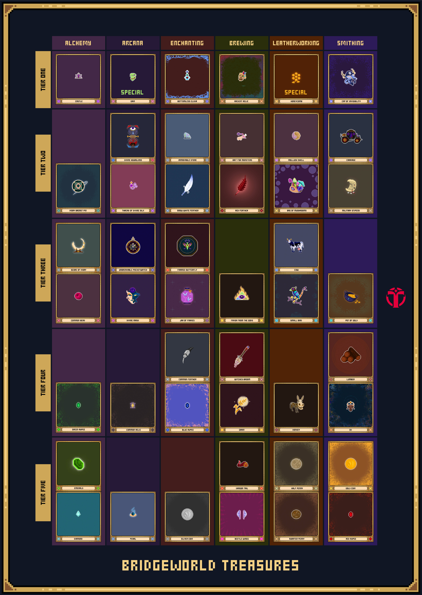

# The Forge



### What is the Forge?

The Forge is where Legions can utilize assets to craft new assets with varying utility in Bridgeworld. Increasing Legions’ Crafting Levels enables them to craft more difficult recipes.&#x20;

 (1) (1).png>)

### What types of crafts can Legions perform?

Legions have the option to craft **Treasures** or **Consumables**. \
\
**Treasures** are artifacts made powerful by exposure to MAGIC. They act as productive resources across Bridgeworld and beyond. There is some mystery between the exact relationship between Treasures and MAGIC, but they allow it to be wielded in ways that are not possible in its natural state. \
\
Legions can use Treasure Fragments and Prism Shards to craft Treasures. \
\
Legions can use Treasures to craft **Consumables**. Consumables are a category of assets that use Treasures (e.g. beetle-wing, diamond, carriage) to create powerful assets in Bridgeworld.  There are 3 types of consumables. More details on consumables will be discussed in subsequent sections.&#x20;

### How do you craft Treasures?

To craft Treasures, your Legion will need to go on quests in the Ivory tower to find varying tiers of Treasure Fragments. While questing, legions also receive assets known as Prism Shards which are required in combination with Treasure Fragments to create Treasures.  Note - Legions do not earn XP from crafting.

Crafting Treasures require specific Treasure Fragment tiers and affinities to craft a Treasure of that specific tier/affinity. There are 3 categories of treasure affinities:\
&#x20;    1\.  Alchemy/Arcana\
&#x20;    2\. Enchanting/Brewing\
&#x20;    3\. Leatherworking/Smithing

Each affinity category has five tiers of treasures within it (see **Treasure Affinities**).&#x20;

Legions craft Treasures:\
&#x20;    \- Near instantly (there is no crafting time)\
&#x20;    \- With a 100% success rate\
&#x20;    \- Without the need to pay MAGIC

#### Recipes for crafting Treasures

To craft Treasures, users need Prism shards and Tier-specific Treasure Fragments. Legions can craft any Treasure except Honeycomb and Grin. See below for the

| Treasure Tier to Craft | Prism Shards Required | Treasure Fragments Required | MAGIC Cost | Craft EXP Gain |
| ---------------------- | --------------------- | --------------------------- | ---------- | -------------- |
| T5                     | 2                     | 12                          | 0          | 0              |
| T4                     | 4                     | 12                          | 0          | 0              |
| T3                     | 8                     | 12                          | 0          | 0              |
| T2                     | 16                    | 12                          | 0          | 0              |
| T1                     | 24                    | 12                          | 0          | 0              |

#### Treasure Affinities

## Consumables

Legions can use Treasures to craft consumables. The 3 types of consumables that exist today are Prisms, Harvester Parts, and Extractors.&#x20;

**Note** - Crafting consumables cost 5 MAGIC.

#### Prisms

Prisms are used to reduce the summoning duration of new Legions in the Summoning Circle and increase the chance of receiving a more rare Legion during Summoning.&#x20;

There are 3 types of Prisms (small, medium, large). When crafting Prisms, Legions have the chance to receive one  of the following types of Prisms: \
\
&#x20;    \- Small - 75% drop chance

&#x20;    \- Medium - 15 % drop chance

&#x20;    \- Large - 10% drop chance

The bigger the prism the more benefit your Legion receives when summoning (see below).&#x20;

#### Harvester Parts

Harvester Parts grant Legion’s access to Harvesters. Each staked Part increases how much MAGIC a wallet can deposit into the harvester by 30,000 MAGIC. Legions must be crafting level 3 or greater in order to craft a Extractor.\
\
**Note - There is a 100% chance of success when crafting your first harvester part and a 0.01% chance to craft 2 or more Harvester Parts with the same Auxillary Legion. Genesis Legions have a 2% change to craft 2 or more Harvester Parts.**&#x20;

#### Extractors

Extractors give your harvester a _temporary_ boost to the Harvester’s mining power. A maximum of 10 Extractors can be staked in a harvester at once. Legions must be crafting level 5 or greater in order to craft a Extractor.

There are 3 types of Extractors (small, medium, large). See below for the likelihood a legion crafts a certain size of Extractor and their associated boost they will have in Harvesters. &#x20;

| Extractor | Drop Chance | Mining Boost % |
| --------- | ----------- | -------------- |
| Small     | 75%         | 20%            |
| Medium    | 15%         | 25%            |
| Large     | 10%         | 30%            |

### How long does it take to craft Consumables?

| Consumable     | Crafting time (in hours) | Success Rate of Crafting                                                                                                                                                              |
| -------------- | ------------------------ | ------------------------------------------------------------------------------------------------------------------------------------------------------------------------------------- |
| Prism          | 47.5 hours               | 100%                                                                                                                                                                                  |
| Harvester Part | 35.5 hours               | 
100% for your first part and 0.01% chance to drop 2 or more Harvester Parts with the same Aux Legion. Genesis Legions have a 2% change to craft 2 or more Harvester Parts. 
 |
| Extractor      | 47.5 hours               | 100%                                                                                                                                                                                  |

### **How many Crafting Points are needed to level up?**

In Season 1, Legions will have a maximum of 6 Crafting Levels. Increasing Legions’ Crafting Points (CP) enables them to craft more difficult recipes when crafting consumables. Crafting experience and, in turn, levels are automatically awarded for each successful consumable craft (see below).

.jpg>)

### **What are the ingredients needed for each Consumable Recipe?**

Each consumable requires a different number of  Treasures as ingredients (see below).&#x20;

| Consumable     | # of T1 Treasures | # of T2 Treasures | # of T3 Treasures | # of T4 Treasures | # of T5 Treasures |
| -------------- | ----------------- | ----------------- | ----------------- | ----------------- | ----------------- |
| Prism          | 0                 | 0                 | 1                 | 2                 | 4                 |
| Harvester Part | 1                 | 1                 | 2                 | 2                 | 5                 |
| Extractor      | 0                 | 1                 | 1                 | 3                 | 4                 |

### **Treasure Break Rates during crafting**

When crafting consumables, Treasures have a chance of breaking. Broken Treasures are sent to the World Treasury, where they will be recycled and re-distributed as rewards for quests.

With the exception of Grin and Honeycomb, Treasures’ likelihood of breaking are based on their Tier. Treasures break during the process required to extract and apply the MAGIC at their core to Legions' craft. Legions who break a Grin or Honeycomb report feeling a tremor that shakes the very foundation of Bridgeworld, an Essence of Grin or Honeycomb in the debris.

| Treasure       | Max uses | Probability that it will break during crafting |
| -------------- | -------- | ---------------------------------------------- |
| Grin/Honeycomb | 1,000    | 0.30%                                          |
| Tier 1         | 108      | 2.74%                                          |
| Tier 2         | 54       | 5.40%                                          |
| Tier 3         | 42       | 6.88%                                          |
| Tier 4         | 25       | 11.29%                                         |
| Tier 5         | 18       | 15.33%                                         |

### **How do Consumable success rates interact with Treasures’ break chance?**

**When your craft is successful**, 100% of the MAGIC cost is consumed. Additionally, all the Treasures used in the recipe have a chance of breaking. For example: For a **prism recipe**

* The ingredients required are 1 x T3, 2x T4 and 4 x T5 Treasures
* They have a 6.90%, 11.30% and 15.30% to break, respectively.
* The RNG is run against each of the Treasure. If the RNG hits the corresponding threshold probability, your Treasure breaks and is burned. This is repeated for each of the Treasures.

#### ****
