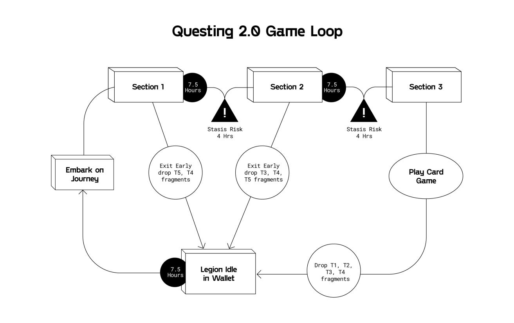

# Ivory Tower

## Questing Overview

The Ivory Tower is where Legions can set out on quests in search of Essence of Starlight, Treasure Fragments, and Prism Shards. **NOTE:** Genesis Legions have the added advantage of finding full Treasures (in addition to the above).&#x20;

Rewards from questing are used in a variety of ways across Bridgeworld. For example, Treasure Fragments can be used to [Mini Craft](ivory-tower.md#docs-internal-guid-074a1c70-7fff-47e5-488b-7903cf74a406) full Treasures at [The Forge](the-forge/). Essence of Starlight, a liquid form of MAGIC, is used to tattoo Legions with one of Bridgeworld's constellations onto their skin so they can equip more Treasures while on quests to earn higher tiered Treasure Fragments.

Legions gain experience as they explore Bridgeworld’s frontiers. Questing points are awarded after each completed quest and are used to increase a Legion's questing experience level. The higher a Legion's questing level, the farther they can go in a quest. Currently the farthest a Legion can travel in a quest is through [Part 3](ivory-tower.md#questing-zones-and-fragment-drops). &#x20;

## Embarking on Quests <a href="#docs-internal-guid-de6c823b-7fff-1266-a429-e0660af7e70c" id="docs-internal-guid-de6c823b-7fff-1266-a429-e0660af7e70c"></a>

There are three regions a Legion can quest in. Each region drops a specific affinity of Treasure Fragments which can then be used to Mini Craft full Treasures based on their affinity type. View [here](the-forge/#treasure-affinities) for an overview of Treasure affinities.


Legions have the opportunity to quest through three parts of a quest. In order to progress further into a journey, Legions must satisfy questing level requirements:

* Part 1: Requires Legions to be at least Questing Level 1
* Part 2: Requires Legions to be at least Questing Level 2
* Part 3: Requires Legions to be at least Questing Level 3

Continuing a journey for rarer Treasures comes with risk. Users forfeit whatever loot they earned in the previous sections **(see** [**Rewards Section**](ivory-tower.md#quest-rewards)**)**, and run the risk of falling into “stasis”, which will temporarily immobilize the legion (4 hrs at the time of writing).&#x20;

Each level of constellation reduces stasis risk from the default 30% chance:&#x20;


#### Region Constellation Types

Each questing region is affiliated with **two** elemental constellations. In order for constellations to have any effect for a particular region (i.e., reduce stasis and enable Treasures to be equipped), Legions must upgrade one of the two correct constellations for the right region. The “region elemental affinities” are as follows:

* Corruption Canyons: Earth, Fire
* Desert Ruins: Water, Wind
* Icy Ascent: Dark, Light

#### Equipping Legions with Treasures

Legions with a Questing Level of at least 3 have the opportunity to quest through Part 3, which gives them the opportunity to play Treasure Triad (a card game described in more detail below). In order to play Treasure Triad, Legions need to equip at least 1 Treasure on their quest. **NOTE:** Legions below Questing Level 3 can still quest but will not be able to reach Part 3.&#x20;


### Questing Overview Diagram



## **Ending Journeys with Treasure Triad**


Treasure Triad Video Tutorial


Legions who have a Questing Level of at least 3 and equipped Treasures must play the Treasure Triad game in the last part of their quest. The goal is to flip as many cards to your control, which boosts the chance your Legion receives higher tiered Treasure Fragments and/or Treasures.&#x20;


The game works as follows:

1. Cards have 4 stats for the “north”, “east”, “south”, and “west” sides of the card.&#x20;
2. When a card is placed next to another card, if the stats on your card are higher on the touching sides, you flip the adjacent cards to your color.
3. Players can place **up to 3 cards** on the grid by dragging and dropping a Treasure from their deck to an unflipped grid location of their choice.&#x20;
   * Simply click on a card to unplay it and move it back to your deck.&#x20;
4. Grid cells with a purple color have a status effect of “corruption”. If you do not play a card on a corrupted grid cell, your legion will be put in stasis (frozen for X hours).&#x20;
   * Game generates at most 2 corrupted cells.
   * 1 unflipped “corruption” grid cell ⇒ 12 hrs stasis
   * 2 unflipped “corruption” grid cells ⇒ 24 hrs stasis
   * **NOTE:** Genesis Legions cannot be put in stasis
5. Once you play 3 cards, click “End Games” to submit a transaction to end or restart your quests. Note that you do not have to place all 3 cards to finish a game.
6. The more cards flipped into your control, the higher the drop rate:
   * 1 card ⇒ +3%
   * 2 cards ⇒ +6%
   * 3 cards ⇒ +9%
   * Fragment standard drop rate is 60% so 3 cards flipped = 60 + 9 = 69%

 (1).png>)

### Additional Game Mechanics

Two grid cells in the game are randomly selected to have affinities, and matching Treasures/Legions with them will offer game boosts:

* Treasures are grouped into affinities of Alchemy, Arcana, Brewing, Enchanting, Leatherworking, and Smithing
* If a Treasure matches the affinity of the cell it is placed on, the card enjoys a +1 stat boost on all sides.
  * For example, Donkey is a Leathworking Treasure so when it is placed on a cell with a Leatherworking affinity, it will enjoy a +1 boost to stats
* Each Legion class is associated with multiple affinities (see chart below). If a Legion matches the affinity of a Treasure that also matches the affinity of the cell it is placed on, the card enjoys a +2 stat boost on all sides.
  * For example, Donkey is a Leatherworking Treasure, so when it is placed on a cell with a Leatherworking affinity by a Legion with class Assassin, it will enjoy a +2 boost to stats

| Legion Class                                                                     | Affinities               |
| -------------------------------------------------------------------------------- | ------------------------ |
| 1/1 (Bombmaker, Clocksnatcher, Dreamwinder, Fallen, Warlock)                     | All                      |
| All-Class (Ashen Kingsguard, Clockwork Marine, Executioner, Reaper, Shadowguard) | All                      |
| Numeraire                                                                        | Alchemy & Arcana         |
| Riverman                                                                         | Brewing & Enchanting     |
| Ranger                                                                           | Alchemy & Leatherworking |
| Fighter                                                                          | Enchanting & Smithing    |
| Spellcaster                                                                      | Arcana & Enchanting      |
| Siege                                                                            | Alchemy & Smithing       |
| Assassin                                                                         | Brewing & Leatherworking |

### Treasure Triad Card Stats


## Quest Rewards

.png>)

Drop rates for Treasure Fragments ([**soulbound** ](https://vitalik.eth.limo/general/2022/01/26/soulbound.html)**and non-transferable**) are set to 60%, and each region drops a category of Treasure Fragments as follows:

* Corruption Canyons ⇒ Alchemy/Arcana Fragments
* Icy Ascent ⇒ Enchanting/Brewing Fragments
* Desert Ruins ⇒ Smithing/Leatherworking Fragments

The probability of finding different rarity tiers of Treasure Fragments are as follows:

.png>)

Questing XP and other loot earned depends on the distance traveled:

 (1).png>)

Legions questing in any region or part have a 0.001% chance of finding a [Universal Lock](https://trove.treasure.lol/collection/consumables/10).

### Bonuses for Questing Level 4/5/6 Legions <a href="#docs-internal-guid-c9503063-7fff-6414-44f5-cb6801d60334" id="docs-internal-guid-c9503063-7fff-6414-44f5-cb6801d60334"></a>

Legions with Questing Level 4, 5, or 6 have higher chances of finding Treasure Fragments:

| Questing Level | Increased likelihood of Treasure Fragment drops |
| -------------- | ----------------------------------------------- |
| Level 4        | + 2%                                            |
| Level 5        | + 4%                                            |
| Level 6        | + 6%                                            |

### Bonuses for Genesis Legions <a href="#docs-internal-guid-c9503063-7fff-6414-44f5-cb6801d60334" id="docs-internal-guid-c9503063-7fff-6414-44f5-cb6801d60334"></a>

Genesis Legions are immune to stasis in questing, have higher chances of finding Treasure Fragments, and have an additional chance to earn a full Treasure during quests:

.png>)

## Questing Tutorial



## Mini Crafts <a href="#docs-internal-guid-074a1c70-7fff-47e5-488b-7903cf74a406" id="docs-internal-guid-074a1c70-7fff-47e5-488b-7903cf74a406"></a>

Mini Crafts are entry level crafting recipes for players to experiment without the risk of breaking Treasures. Mini Crafts use Treasure Fragments and Prism Shards to craft a Treasure. Some notable features include:&#x20;

* Mini Crafts are accessible by Legions with any Crafting Level
* Mini Crafts are instant
* Mini Crafts have no influence on summoning probabilities
* Fragments are soulbound and cannot be mass purchased to max out crafting level

View [here](https://docs.treasure.lol/bridgeworld/bridgeworld-litepaper/the-forge) for more information on Mini Crafts.&#x20;

## Fragment Swapper

Due to a bug causing Treasure Fragments dropped during quests through the Desert Ruins and Icy Ascent to be switched, we have deployed a Fragment Swapper smart contract that will allow you to swap Brewing/Enchanting and Leathworking/Smithing Treasure Fragments of any tier for a limited time. The bug was patched on Monday, June 6, 2022 and all quests started after then will drop the correct Fragments without requiring any swapping.

NOTE: Alchemy/Arcana Treasure Fragments will **NOT** be eligible for swapping as they were not affected by the bug.

### Instructions

1. Go to the [Fragment Swapper contract on Arbiscan](https://arbiscan.io/address/0x54d154524a7D27FBEd750bf0bfF95822C5667256#writeProxyContract) and navigate to Contract > Write as Proxy
2. Click "Connect to Web3" and connect your wallet
3. Scroll down to `9. swapFragments`
4. Enter the list of Fragments you want to swap with the following format:

```
[[tokenId1,quantity1],[tokenId2,quantity2],...]
```

Eligible Treasure Fragment token IDs are as follows:

#### Brewing/Enchanting

| Tier | Token ID |
| ---- | -------- |
| T1   | 6        |
| T2   | 7        |
| T3   | 8        |
| T4   | 9        |
| T5   | 10       |

#### Leatherworking/Smithing

| Tier | Token ID |
| ---- | -------- |
| T1   | 11       |
| T2   | 12       |
| T3   | 13       |
| T4   | 14       |
| T5   | 15       |

For example, if you want to swap three T4 Brewing/Enchanting Fragments and two T5 Leathworking/Smithing Fragments, your input would be:

`[[9,3],[15,2]]`

5\. Click "Write" and send the transaction

6\. Wait a few minutes, then view your updated Resources inventory on the Bridgeworld UI

If you encounter any issues or need assistance with the input formatting, please create a ticket on Discord in the [#bw-tickets channel](https://discord.com/channels/882867268021800991/974076966707798056)
