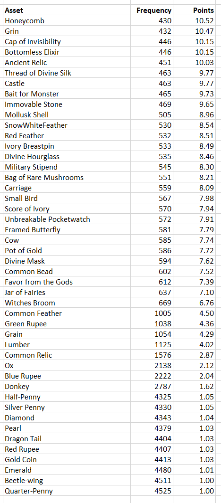

# Staking Your Treasure

## What are Treasures' emission?

For every Treasure staked you collect points (see table below).&#x20;

The sum of all points determine your stake of the mine. In total 22,222 MAGIC is paid our per day and you get a share of your total points compared to the overall points of all people staked.&#x20;

## How are the point distributions for the Treasure Mine calculated?

Your deposited points, divided by total points deposited, equals your share of emissions.

## Why are MAGIC emissions for Treasures so low?

Treasures do not start and end at the Genesis Mine. We have way bigger things in store for Treasures, so feel free to earn some extra $MAGIC in the meantime!

## Differences between L1 and L2 Treasures

Treasure started as a free mint on the Ethereum Mainnet. Due to the points listed in [migrating-treasures-to-arbitrum.md](../migrating-to-arbitrum/migrating-treasures-to-arbitrum.md "mention"), Treasure moved to Arbitrum (L2). Only Treasures on Arbitrum can be used within the Treasure ecosystem. The last migration for the foreseeable future occurred on 9 Dec UTC. Other methods for migrating L1 treasures may be possible in the future.&#x20;

## Can I stake my original, unravelled Treasure cards that are on the Ethereum Mainnet?

No. You'll have to wait until there's another migration where they'll be ported to Arbitrum.
