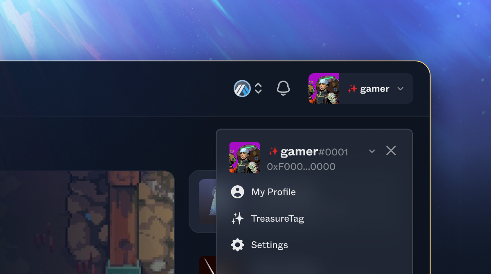

# TreasureTag

## What is a TreasureTag?

The TreasureTag ("Tag") is a free, soulbound (non-transferrable) gamertag that will serve as your global player profile, identity, and the basis for user reputation across the Treasure gaming ecosystem. Your Tag will allow you to own your identity and will be required to participate in upcoming product releases including the future Proof of Play meta game (TreasureXP, Treasure Achieve, and Treasure Quests), among other experiences that may be accessible to only those who possess a Tag.

In the long term, your Tag can be linked to avatars to power up your social identity, earned badges to showcase your greatest achievements, and even benefit from cosmetic modifiers to alter the appearance of your Tag to stand out.&#x20;

The Tag is comprised of two parts: (1) a name; and (2) a discriminant (4-digit ending similar to Discord). Players will be limited to one Tag per wallet.

<figure><figcaption></figcaption></figure>

## Player Benefits

* Feel like a player and less like an anonymous 0x1234 wallet address
* Customize how the community sees you to match your own personal style
* Access Tag-gated events and features

### **Game Benefits**

* Show names on your leaderboard over unmemorable wallet addresses
* Attract users who want to flex their individuality by targeting Tag-gated events, competitions, activities, and features
* Enable greater interoperability across Treasure by collaborating on game-specific cosmetic modifiers or badges

### Creator Benefits

* Potential opportunities for creator-specific cosmetic modifiers that stand out to your audience
* Potential tie-in to future creator programs launched by Treasure enabled by the TreasureTag

## FAQ

What is a TreasureTag?

The TreasureTag is a free, soulbound gamertag that will serve as your global player profile, identity, and the basis for user reputation across the Treasure gaming ecosystem. Your Tag will allow you to own your identity and will be required to participate in upcoming product releases including the future Proof of Play meta game (TreasureXP, Treasure Achieve, and Treasure Quests), among other experiences that may be accessible to only those who possess a Tag.

How do I get a TreasureTag?

You will be able to reserve and mint your Tag (when it launches) [on Trove here](https://trove.treasure.lol/treasuretag). TreasureTags, at this time, will be free to reserve and mint (beyond accompanying gas fees).

Are TreasureTags unique?

Tags are semi-unique. There can be multiple people with the same name (so as to avoid users not being able to choose their own name or handle that they've used since childhood – a challenge we know very well as lifelong gamers) but the discriminant (the 4 numbers at the end) will need to be unique.\
\
For instance, there can be multiple users with the Tag name `karel` but there can only be one `karel#0001`. There can be a maximum of 10,000 `karel`'s in existence though as the discriminant will range from 0000-9999.

What types of characters are allowed in the Tag?

Only alphanumeric characters and hyphens are allowed in the Tag's name. Hyphens must be between characters and cannot be doubled up ("--") or at the start or end of the name. Only numbers are allowed in the discriminant. No special characters (including but not limited to `!@#$%^&*()_+`) are allowed.

<strong>What is a discriminant?</strong>

The discriminant is the 4 numbers at the end of the Tag (#0000).

What games, infrastructure, or other products currently support TreasureTags?

For now, not many!&#x20;

We are still in our reservation stage to obtain your TreasureTag. As we go live and more Tags are minted by users, we will be working with all of our partners to implement this into their games and tools. The [Trove](https://trove.treasure.lol/) marketplace will likely be the first place you will see your TreasureTag come to life.

We follow the widely adopted standards created by ENS to allow for easy adoption for dapps that support ENS to leverage TreasureTags in the future.

Do TreasureTags expire?

Currently, TreasureTags are not planned to expire (unlike ENS Domains). This may be subject to change in the future.

Are TreasureTags NFTs?

Yes, TreasureTags are NFTs (ERC-721s) that can be minted and owned by a wallet.

Can TreasureTags be transferred?

No, TreasureTags are soulbound / non-transferrable. If you would like to obtain another TreasureTag, you will need to use a different wallet address.

Can I rename, edit or update my TreasureTag (name or discriminant)?

During the reservation stage, you will be able to rename and edit your TreasureTag freely.&#x20;

Once the TreasureTag has been minted, there may be a small MAGIC cost associated to update your TreasureTag so please take the time during the reservation stage to choose wisely to avoid any potential future costs!

Can I see the wallet address behind a user's TreasureTag (like ENS)?

Yes.

Can I find a TreasureTag if I know a user's wallet address (like ENS)?

Yes, you will be able to find their TreasureTag using the Arbiscan explorer as well as a potential lookup tool to be created in the future.&#x20;

How long can Tags be?

Between 1-12 characters in length for the name. The discriminant is comprised of 4 digits between 0000-9999.

Is TreasureTag built on top of an existing standard (eg. ENS domains)?

Yes, the TreasureTag is derived from the ENS standard.

Can I store text and unique metadata on my TreasureTag (like ENS)?

Yes, you will be able to store text and unique metadata on your TreasureTag, including avatars, descriptions, social media and website links, and other details similar to ENS.

Does my TreasureTag replace Smol Domains (.smol) and any .smol domains  that I own?

No, TreasureTag will be able to co-exist alongside [Smol Domains](https://www.smol.domains/) built by long-standing community member, Astro. If a user owns both a TreasureTag and .smol domain, it is planned to eventually allow users to select between showing the Tag or .smol domain. If a user only possesses a Tag, they will see the original treatment of the TreasureTag above with the red magic sparkle. If a user only possesses a .smol domain, they will see the text-based domain ending in .smol (eg. `gamer.smol`).

.jpg>)\

