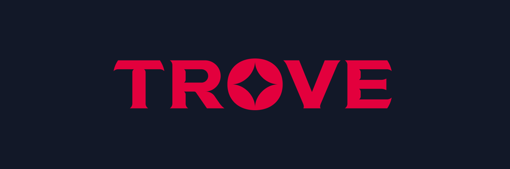

# 💌 Letter from the Trove Team (Mar 17, 2022)

Hello Treasure fam!

Since our last update, we wanted to share some news regarding Trove, the forthcoming gamified NFT marketplace powered by TreasureDAO. In this, we’ll cover some exciting recent developments in the following areas:

* Scaling up Trove’s team
* Our initial plans, launch program, and assessment framework
* New logo
* Answers to frequently asked questions from the community
* ⛓ (?!)

## Scaling Up

Since the announcement in February, we have been hard at work hiring to scale the team. To execute on our ambitious roadmap and go-to-market strategy, we have recruited talented professionals in dev, design, product, and other operational roles to bring Trove to life. As it stands, the team of 11 comprises the following full-time and part-time members (\* denotes a new member of the Treasure team):

* **jumpman#0001** - Trove Lead (ex-Amazon)
* **t1dev#8677** - TreasureDAO CTO & Trove Technical Lead (ex-Amazon)
* **\*karel#6741** - Trove PM (Treasure Tools, former VC and startup studio builder)
* **\*Zinko** - Program Manager (ex-Google)
* **sisu#1337** - Ecosystem Coordinator (former UX Designer)
* **Duke#1000** - Concept Artist and Illustrator
* **vinnytreasure#9958** - Solidity Developer&#x20;
* **\*frannyverse#2033** - Front-End Developer (Manifold and ex-Dropbox)&#x20;
* **\*Antlion#2676** - Backend Developer (ex-Google)
* **\*Peyton#4374** - UI/UX Designer (ex-Electronic Arts)
* **\*a1rport#6969** - Communications (Corporate lawyer - M\&A)

We are advancing in our interview processes to hire even more talent and expect to unveil other roles to fill on the Trove team in the coming weeks and months.&#x20;

## Trove’s Launch

Treasure has always had a bias for action and we are constantly working to strike a solid balance between, as they say, “moving fast and breaking things”, and releasing top quality products that will endure and add lasting value to our entire ecosystem and the DAO at-large.

With the pace that new projects are emerging and building in and around the Treasure ecosystem on Arbitrum, the team contemplated (at length) building an alpha version of Trove that would have feature parity with the Treasure Marketplace and launch earlier ahead of the Q2 timeframe. After numerous team discussions and input from long-standing members of the community, we ultimately decided that we would continue down our original path of building a feature rich product that will not only stay true to the [Trove Whitepaper](https://drive.google.com/file/d/1FyuF2To5nhXatlxHjIGhUkjcRcaQYjPR/view) but that we also think will transcend other NFT marketplaces that are currently out there in the market.

Beyond standing up a separate team focused on Trove, we have made significant progress to ramp up development and we’re all looking forward to working with the community to build an NFT marketplace that truly puts you – the users and community – first.&#x20;

Oh, and did we mention that we have a new spiffy logo?

## Launch Program Update

On February 19, we opened up a window for potential Trove projects to apply to be considered for our launch program and receive perks for launching their project exclusively on Trove upon its release. The full list of incentives can be found in [this link](https://twitter.com/TroveByTreasure/status/1495229496646979586). As of March 15, this window has now closed and we have been focused on reviewing and clearing our queue of partnership submissions. Dozens of discussions have already taken place and we have set up private channels with these projects in the TreasureDAO Discord to continue these conversations. We humbly ask for your continued patience as we work through our extensive pipeline.&#x20;

We will be announcing our first set of Trove launch partners in short order so please stay tuned!&#x20;

### Submission Process

The below outlines the process that we are using to assess potential Trove launch partners. The timeline from start to finish is estimated at 1-2 weeks based on the volume of submissions.

1. **Complete submission form** ([link to form](https://docs.google.com/forms/d/e/1FAIpQLScd\_G8RCJwTlk2SwN4hUnAX1lAYmK0O3HJgijkH5sYeKhl0Rg/viewform))
   1. Project overview (name, description, type)
   2. Team and experience (background, level of commitment to project)
   3. Link to whitepaper/litepaper, artwork samples, other relevant artefacts / materials
   4. Links to socials (eg. website, Discord, Twitter, etc.)
2. **Shortlist & Initial Review**
   1. Treasure Ecosystem Council reviews proposals each week and shortlists for further review&#x20;
      1. Projects who do not pass the initial review phases and satisfy basic key assessment criteria will be notified&#x20;
   2. For shortlisted projects:
      1. Trove Ecosystem Coordinator will set up a group discussion to coordinate a meeting and additional information sharing&#x20;
      2. Initial project discussion with members of the Treasure Ecosystem Council&#x20;
3. **Ecosystem Council Review**
   1. Treasure Ecosystem Council performs detailed review against assessment criteria&#x20;
   2. Final meeting and/or follow up questions with project team
   3. An internal unanimous vote by the Treasure Ecosystem Council is required for approval&#x20;
      1. Projects who do not pass will be notified
4. **Implementation**
   1. Steps to be shared&#x20;

### Launch Partner Assessment Criteria

We have developed several criteria that projects must meet in order to be eligible as Trove launch partners which can be seen below.&#x20;

Outside of this, we will be looking to work with great community-led initiatives such as [**Treasure Map**](https://treasuremap.lol) (founded by _aikon#9211_) and [**Smolpad**](https://www.smolpad.lol) (founded by _Astrololo#5065_) to supplement our research and project assessment framework. The teams behind these two initiatives have been working tirelessly to monitor and assess new projects being launched in and around the Treasure ecosystem on Arbitrum, and we thank them for their incredible efforts!&#x20;

| Criteria                                 | Key Factors                                                                                                                                                                                                                                                     |
| ---------------------------------------- | --------------------------------------------------------------------------------------------------------------------------------------------------------------------------------------------------------------------------------------------------------------- |
| **Passes Negative Screens**              | <ul><li>Blatant copies of existing projects (note: this excludes derivatives or extensions)</li><li>Any projects inciting hate or violence towards any group</li><li>Projects which use copyrighted materials without permission</li></ul>                      |
| **The Basics**                           | <ul><li>
NFTs will be denominated in ETH (and not $MAGIC)
<ul><li>$MAGIC or a native token can still be incorporated in other ways</li></ul></li></ul>                                                                                                     |
| **Capable Team**                         | <ul><li>Full time resourcing of key team members with key devs in-house</li><li>Right mindset (open, collaborative, builders, long-term)</li><li>Nice to have: pre-existing experience with other NFT projects and doxxed</li></ul>                             |
| **Clear Market, Roadmap and Tokenomics** | <ul><li>Clearly articulated target user base with a defined value proposition (relative to others)</li><li>Defined roadmap (high level)</li><li>Sustainable token and/or business model (ie. not a ponzi or “rug”, eventual path to self-sufficiency)</li></ul> |
| **Community Alignment and Fair Launch**  | <ul><li>Fully free mint or partially free mint with clear rationale/plan on paid portion</li><li>Fair mint and launch process through equitable “allowlist” measures</li></ul>                                                                                  |

## FAQ

| **When will Trove launch?**                                                                                     | The full version of Trove is still slated for launch in Q2. A more precise date will be shared in the coming weeks.                                                                                                                                                                                                                                                                                             |
| --------------------------------------------------------------------------------------------------------------- | --------------------------------------------------------------------------------------------------------------------------------------------------------------------------------------------------------------------------------------------------------------------------------------------------------------------------------------------------------------------------------------------------------------- |
| **What will Trove be denominated in?**                                                                          | At launch, Trove will be denominated in ETH.                                                                                                                                                                                                                                                                                                                                                                    |
| **Who are the initial launch partners?**                                                                        | We are excited to announce our first set of partners in the coming days - stay tuned for this on our Twitter ([@TroveByTreasure](https://twitter.com/TroveByTreasure))!                                                                                                                                                                                                                                         |
| **As a launch partner, will I have access to all perks from day one?**                                          | While some of the features will not be immediately available from day one, Trove launch partners will be eligible to receive these rewards upon the completion of these features. All launch partners and their collections will have marketplace exclusivity for a period of two weeks at launch.                                                                                                              |
| **Will Trove accept collections with both free and paid mints?**                                                | Yes. While the free mint model will continue to be followed by all core Treasure building blocks and projects (and will be encouraged for other projects), Trove will be open to projects with both free or paid mint models. To learn more about our thinking, [see this Medium post](https://medium.com/@TreasureNFT/evolving-treasures-free-mint-model-3b405224f382).                                        |
| **If my project launches on Trove, will I still be able to be considered for a deeper ecosystem integration?**  | Projects that are interested in a deeper ecosystem integration can still be considered, even if they initially launch on Trove. The ecosystem integration has a rigorous assessment framework and vetting process, and certain key terms must be accepted. For more information, please refer to the [Ecosystem Integration Framework](https://docs.treasure.lol/partnerships/ecosystem-integration-framework). |

## What’s Next?

Stay tuned for another exciting announcement in a few hours! ⛓👀
