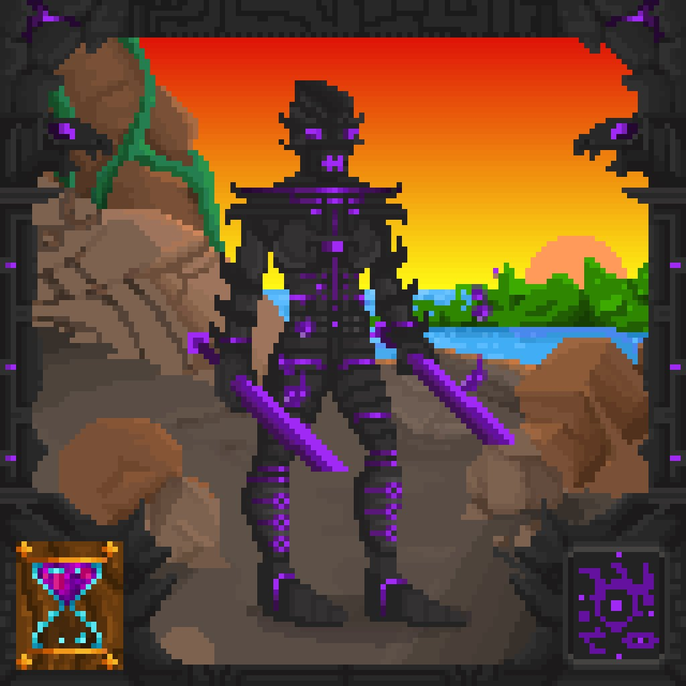

# 👶 Life

## Overview

Life is a long experiential board game. It is meant to be an emotional experience. The NFTs breed like people, not hamsters. Their lifespans are finite but non-trivial, like our own. Life NFTs are not merely collectibles. They will be the first NFT designed to simulate living, as an on-chain experience.

Life is the creation of [@jumpmanft](https://twitter.com/jumpmanft), and is the first project to be built on top of Treasure.


**Life Links**: [Twitter](https://twitter.com/lifenft\_) | [Discord (Community Led)](https://discord.gg/KeMDATw2)


.jpg>)

## How it works

The owner of a Life NFT begins with a newborn wrapped in swaddling cloth. At predetermined intervals, the baby grows — first into a child, then a teenager, an adult, and an elderly person.

Throughout the evolution, the individual will display new traits and undergo age-related changes. They'll go to school, fall in love, take an occupation, experience many triumphs and disappointments unique to their life, and finally, pass away.

The owner of the NFT will be responsible for choosing the direction of the individual’s life. Transferring the NFT to another wallet would “reset” the individual back to a newborn, its life erased. At death, the owner will receive a commemorative NFT of the person that they shepherded through the world.

.jpg>)  

## **Team**

* [@jumpmanft](https://twitter.com/jumpmanft)
* [@DukePaints](https://twitter.com/DukePaints)
* [@mao](https://twitter.com/Mezereth)
