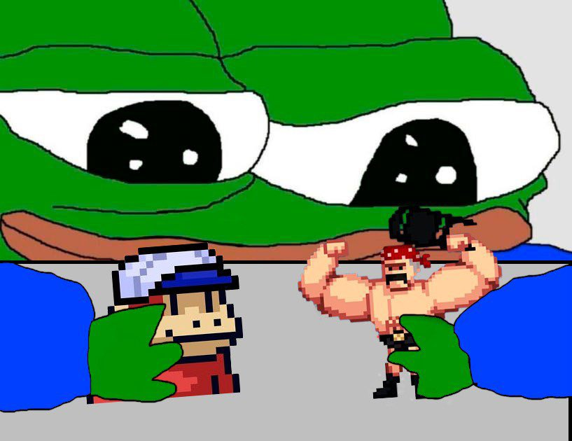
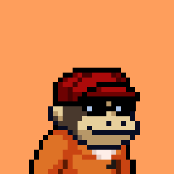

# 🧠 Smolverse

## Overview

BUILDING A SMOLVERSE WITH FREE MINTS AND GOOD VIBES.&#x20;

The long term vision (dream) of Smolverse is create a metaverse (either pixelated or 3D) where smolfrens can walk around, drive, shop, hang out.&#x20;




**Please Note**: Smolverse currently encompasses Smol Brains and Smol Bodies.


## Smol Brains

You start with 2 monkeys and a piece of land. You are able to stake your monkeys to earn IQ. Collective IQ is rebasing. The more IQ that is staked, the faster the monkeys breed and the bigger brained their children. The bigger brain the monkey society, the more opportunities available to individual monkeys, such as building on their land or even going to space!

For more details, read [Smol Brains: A Beginner’s Guide](https://medium.com/@SMOLBRAINS/smol-brains-a-beginners-guide-268e1b24aab8).


**Smol Brains Links**: [Website](https://www.smolverse.lol) | [Mint](https://smolverse.lol/station) | [Stake](https://smolverse.lol/stake) | [Discord](http://discord.gg/smolbrains)


### Potential Plans

 (1) (1) (2) (1) (1).png>) 

### Smolbot&#x20;


This unofficial bot was developed for fun by **cureForOptimism#5061**. Smol admins are not associated with this bot and won't be able to assist you with any potential issues. Please ping **cureForOptimism** on the Smol Brains Discord with any feedback/questions.


Go to the [Smol Brains Discord](https://discord.gg/gBYkwEk4fN) --> `#bot-spam` channel and check the pinned post for a list of available commands or run `!smolhelp`. As an example, you can animate your Smol using `!pfp <token_id> reverse faster faster faster`.

 

## Smol Bodies

The Smol Bodies will inhabit a gym near you, stacking $plates to earn muscle and to not be smol.

Smol Bodies is also an experiment in decentralization. Community members have been selected to lead the project alongside Treasure’s development team, and community ideas, feedback and suggestions will drive development.


**Smol Bodies Links:** [Website](https://www.smolverse.lol) | [Mint](https://smolverse.lol/station) | [Stake](https://www.smolverse.lol/smolbodies) | [Discord](https://discord.gg/XCKDQfRsXU)


 (1) (1) (1).png>) .png>)

## **Smolverse Team**&#x20;

* [@jpatten\_\_](https://twitter.com/jpatten\_\_) (John) - Founder | Creative Advisor
* [@DukePaints](https://twitter.com/DukePaints) - Concept Artist | Imperium
* [@pixel\_mat](https://twitter.com/pixel\_mat) - Art | Smol Brains
* Professor\_X\_
* Spice
* Trippe
* Twixy
* Wyze
