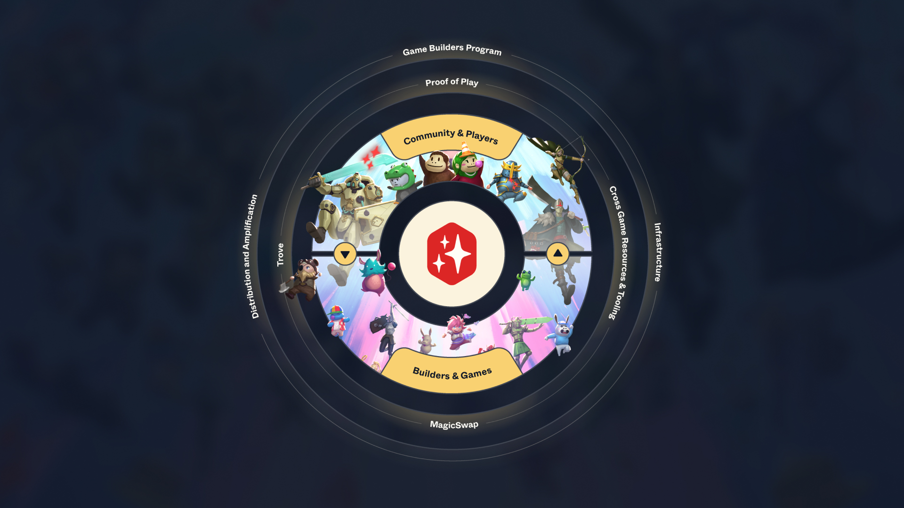
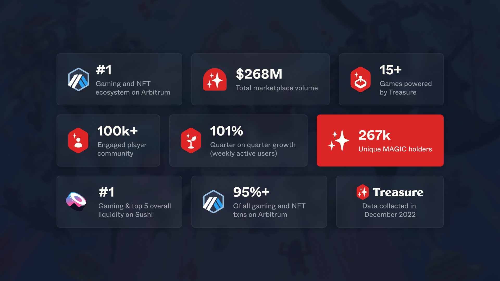

# Game Builders Program

## What is the Treasure Game Builders Program (GBP)?

The **GBP** aims to support and incentivise aligned, high potential games building in the Treasure ecosystem.

There are two integration tiers to aim for:

 **Gold** \
Access the Exclusive Treasure Partners Discord, Treasure and Arbitrum team support, and compete for the chance to win periodic MAGIC rewards as a top driver of ecosystem priorities.

 **Diamond**\
Gold Tier plus end-to-end advisory and support from Treasure’s internal and industry expert Network (including Arbitrum technical and marketing) to kickstart adoption and hypercharge growth.

To access these benefits, game builders must collect and fill their **Treasure Builders Pass (BPass)** with **Badges** obtained from achieving milestones in five key integration areas.

Unlocking fun, composability across games is a key Treasure goal. Experimentation is encouraged, particularly for deeper levels of integration.

## Why Build with Treasure?

Treasure is the #1 gaming destination on Arbitrum with >$265M processed volume, 20+ games and >80k MAGIC holders. We've created a vibrant and intimate community of game builders, creators, and players united around a common purpose – connect through shared experiences and fun!

Building with Treasure launches games into a powerful flywheel of deeply connected communities and builders, strengthened through interoperability. Everything we do at Treasure serves the values of sharing bonds, collaboration, and love. _Treasure is community._

### But don’t just trust our word, here’s what our game partners are saying about Treasure…

> “Treasure has been the perfect place to build upon for us. Not only do they provide crucial and top tier infrastructure to build your game on top of, they also have the most active and enthusiastic community that shares the overall vision and ethos. The team is also incredibly supportive and proactive in terms of marketing, product design and overall community fostering.”&#x20;
>
> [Diego](https://twitter.com/DiegoVidaurres), **Co-Founder** of [The Beacon](https://twitter.com/The\_Beacon\_GG)

> _“Reliable, transparent and consummate builders, Treasure is everything a founder could want in a partner to help bring their game to the masses.”_&#x20;
>
> [Flook](https://twitter.com/Flook\_eth), **Co-Founder of** [Knights of the Ether](https://twitter.com/KnightsOfTheEth)

> _"Building with Treasure has been a fantastic experience. The sincerity behind their support, as well as opportunities provided is unparalleled throughout web3. From social outreach to marketplace integration, Treasure has been swift and helpful in all aspects."_
>
> [Smashe](https://twitter.com/Smashe\_\_), **Co-Founder of** [Tales of Elleria](https://twitter.com/TalesofElleria)

## The Treasure Flywheel

<figure><figcaption></figcaption></figure>

The **Treasure Flywheel** benefits game builders in three key ways:

### **1. Vibrant and Intimate Ecosystem**

* **Community** - Bootstrap adoption by tapping into the most vibrant and engaged web3 gaming community with a rich diversity of experiences.
* **Builders / Games** - Build in an intimate and tight-knit ecosystem of highly aligned and collaborative game developers who work towards common goals.

### **2. Immersive Gaming Experiences**

* **Proof of Play** - Form deeper connections with your community through meta-progression (TreasureXP, Treasure Achieve) and powerful inter and intra game player funnels (Treasure Quests).
* **Platform** - Leverage the premier gaming destination and marketplace on Arbitrum packed with game rich features and world-class developer support.&#x20;
* **MagicSwap** - Tap into powerful cross-game trading with instant liquidity, seamless interoperability and novel barter models to de-emphasise speculation.
* **Cross-Game Resources and Interoperability** - Enhance player retention and engagement by extending assets and IP across an ecosystem of games.&#x20;

### **3. Enablers and Accelerants**&#x20;

* **Game Builders Program** - Elevate your game through expert advisory, support and thoughtful incentives that drive network effects.
* **Distribution and Amplification** - Supercharge your go-to-market through extensive reach, authentic content and deep audience understanding.
* **Infrastructure** - Build faster with Treasure’s toolkit and infrastructure for game builders, including open source code, dev documentation, and more.

## **Treasure in Numbers**

<figure><figcaption></figcaption></figure>

### How to get involved?

If building with Treasure excites you, apply below or reach out to [partnerships@treasure.lol](mailto:partnerships@treasure.lol) if you have any questions.

### [**Apply** **Here**](https://forms.gle/84ft4MzJSjLbKNW69)
