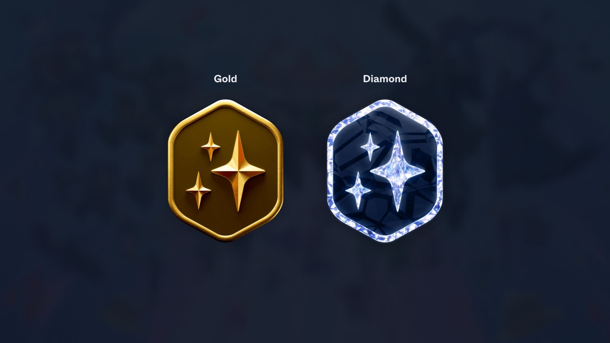
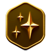
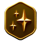

# GBP Partnership Tiers

<figure><figcaption>
Game Builder Partnership Tier Badges
</figcaption></figure>

The following table describes each Tier of the GBP.&#x20;

<table><thead><tr><th width="147">Tier</th><th>Overview</th><th>Benefits</th><th>Requirements</th></tr></thead><tbody><tr><td><strong>A.</strong>   <strong>Gold Integration</strong>   <a href="broken-reference">Learn more</a></td><td>
Access to Treasure’s exceptional support and suite of products, including an exclusive discord for ecosystem builders and creators to collaborate.

Games will also be able to compete for rewards by achieving a top 3 position against ecosystem priorities

Indicative priorities include (subject to change):
<ul><li>Interoperability and Innovation</li><li>Player engagement</li><li>GDP</li></ul></td><td>
Access to the Exclusive Treasure Partners discord for builder collaboration, and Treasure and Arbitrum support 

Opportunity to earn periodic MAGIC rewards for contributing to the ecosystem
</td><td>
<strong>Acquire and retain the following BPass Badges:</strong> 
<ul><li>Platform</li><li>MagicSwap</li><li>Archivist</li></ul></td></tr><tr><td><strong>B.</strong>   <strong>Diamond Integration</strong>  <a href="broken-reference">Learn more</a></td><td>
End-to-end advisory and support across the Treasure Network to supercharge adoption and growth. 

This spans technical, strategy, game design, community building and operations, go to market and funding. Recipients may also gain access to significant content and distribution networks, funding leads and vendor discounts to SaaS providers and tooling.

This tier is targeted at high potential, aligned teams who meet rigorous assessment criteria reviewed by the Game Builders Council. Final recommendations will be reviewed by Treasure’s gaming industry expert.

 
</td><td>

 Gold Tier +

Deepest level of advisory and support from the Treasure Network and Aribtrum (technical and marketing)

 
</td><td>
 

<strong>Acquire and retain the following BPass Badges:</strong> 
<ul><li>Platform</li><li>MagicSwap</li><li>Archivist</li><li>Proof of Play</li><li>Explorer</li></ul>
Token / NFT allocation and/or equity / treasury swap to align incentives
</td></tr></tbody></table>

## Treasure Builders Pass

So you want to redefine gaming with a vibrant community and ecosystem of builders in the **GBP**? Great! You’re in the right place, but you’re going to need a **Treasure Builders Pass (BPass)** first.&#x20;

### **How it works**

The **BPass** is your passport and first step towards entry into the **GBP**. It contains five Integration Areas that will help supercharge games building with Treasure! Teams will receive a **BPass Badge** for each Integration Area satisfied. **Specific BPass Badges** must be maintained for each Tier of the **GBP** as ‘proof of alignment’ with the broader ecosystem.

**Game developers must apply** via the application form to obtain their BPass Badges. Thereafter, periodic reviews starting monthly, will be performed to ensure continued alignment.

## **BPass Badges**

<table><thead><tr><th width="140">Badge</th><th width="174">Overview</th><th>Benefits to Game Developers</th><th>GBP Tier</th></tr></thead><tbody><tr><td><strong>1. Platform</strong> </td><td><strong>Use the Treasure platform as the primary gaming destination and NFT marketplace for your game.</strong></td><td>
Treasure is the premier gaming destination on Arbitrum and the Treasure ecosystem, with >8k monthly active users and >$265m USD equivalent processed to date. 

Packed with unique, gaming rich features such as in-game event drivers, cross-game XP (eg. TreasureXP) and Quests, and world-class developer support, Treasure elevates the gaming experience for both players and builders alike.

 See a paast <a href="https://www.getrevue.co/profile/treasuredao/issues/trove-your-new-gaming-destination-1380149">announcement</a> on Treasure and ‘Proof of Play’
</td><td> <strong>Gold</strong>   <strong>Diamond</strong> </td></tr><tr><td><strong>2. MagicSwap (v2)</strong> </td><td><strong>Use MagicSwap as the primary token and NFT / game item swap protocol (where applicable).</strong></td><td>
MagicSwap will be a key piece of infrastructure that powers cross-game trading of in-game resources and items (eg. NFTs).  

By utilising MagicSwap, games can tap into powerful features such as instant item liquidity via ‘smart merchants’, seamless interoperability via cross-game item trading and web3 gaming economies that de-emphasise speculation through novel barter models.
</td><td>
<strong>Gold</strong> 

 <strong>Diamond</strong> 
</td></tr><tr><td><strong>3. Archivist</strong> </td><td>
<strong>Contribute game information into a shared, Treasure ecosystem repository to enable developers to better pursue cross-game interoperability.</strong>

Key items include tokenomic data for core collections (eg. character NFTs, item NFTs) and contract documentation (eg. contract addresses and comments regarding how the contracts work). 

<em>Note: This will be an evolving list informed by feedback from builders and the community</em>
</td><td>
The Treasure interoperability repository (to be released) is a shared source of contracts and gaming information across games in the Treasure ecosystem. 

It will include best practices, existing code / approaches and identifies opportunities for cross-game interoperability.

By contributing to the repository, game developers will help improve speed to market, seed and nurture cross-game relationships and help pioneer interoperability in gaming.
</td><td>
<strong>Gold</strong> 

 <strong>Diamond</strong> 
</td></tr><tr><td><strong>4. Proof of Play</strong> </td><td>
<strong>Participate in Treasure’s ‘Proof of Play’ framework - TreasureXP, Treasure Quests and Treasure Achieve.</strong>

This includes:
<ul><li>Integrating key actions / in-game events for XP and badges</li><li>Co-designing relevant quests and achievement drops</li><li>Contributing to quest rewards</li><li>Participating in at least [one] quest per [month]</li></ul></td><td>
Treasure’s ‘Proof of Play’ framework is a unique offering targeted at enriching the player experience and improving builder outcomes. 

TreasureXP is a meta experience system that recognises your cross-game accomplishments and good actions across Treasure. It will be earned and used to unlock rewards and perks. It invites deeper player investment and a sense of meta-progression that extends beyond individual games, including social flexing and status based rewards.  

Treasure Quests is a powerful cross-game funnel designed to drive actions (eg. weekly quests) intra and inter game - such as interoperability - in a way that is both fun for players (eg. exploration and completion) and valuable for builders (eg. distribution, acquisition)

 Treasure Achieve is an interoperable badges and achievements framework that games can use to enrich their game experience and players can collect for prestige and rewards.
</td><td><strong>Diamond</strong> </td></tr><tr><td><strong>5. Explorer</strong> </td><td><strong>Explore meaningful interoperability across Treasure.</strong></td><td>Creating fun, interoperable gaming experiences is a strategic priority at Treasure. Games integrating at the highest level will share Treasure’s values to explore and pioneer what interoperable gaming could be.</td><td><strong>Diamond</strong> </td></tr></tbody></table>

**Important:** Treasure views interoperability in gaming as a powerful, untapped design space. However, it is still nascent and largely unproven. Noting this, Treasure’s initial focus is on exploration, education and enablement to help push the industry to discover what could be. A home for ‘all things interoperability’ at Treasure is currently being developed. More details to follow.

#### ✨ [APPLY NOW](https://forms.gle/ekTAxe28tEL1rDNC8) ✨
