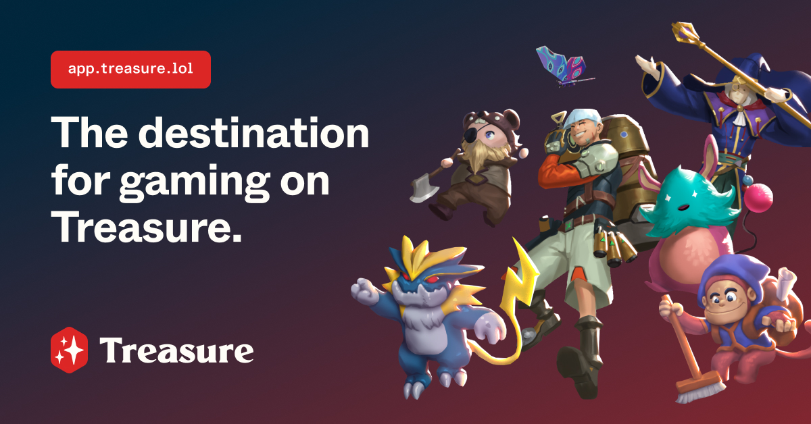

# Treasure Platform

The Treasure platform is your destination for gaming on Treasure. As an asset marketplace, a hub for game discovery and distribution, center for tournaments and events, and much more, Treasure brings together everything that players and game developers could possibly want under a single roof.

👉 Visit the platform: [app.treasure.lol](https://app.treasure.lol)

<figure><figcaption></figcaption></figure>

## For Players

* Play and discover your new favorite games on Treasure
* Collect and trade your game assets and digital collectibles through our marketplace by using MAGIC and ETH
* Earn badges by playing games, collecting assets, and competing in tournaments and events
* Obtain your [treasuretags.md](treasure-identity/treasuretags.md "mention") build your player identity within the Treasure ecosystem
* Showcase your achievements, prized assets, and loved games on your profile

## For Games

* Leverage Treasure as an engine for your game's distribution and discovery with dedicated game and collection pages
* List your game's assets and NFT collections on the platform's built-in marketplace for trading&#x20;
* Engage players through jointly held events and tournaments
* Tap into Treasure's game developer tooling and infrastructure across its marketplace, AMM, "Proof of Play" features (achievements, quests), and more to come

## For Creators

* Join the Treasure Create program for [content-creators.md](../publishing/content-creators.md "mention") and earn an exclusive badge collectible
* Potential for exclusive streaming and video features on the Treasure platform

_**Fun fact!**_ _The Treasure platform was previously known as Trove and the Treasure Marketplace._
